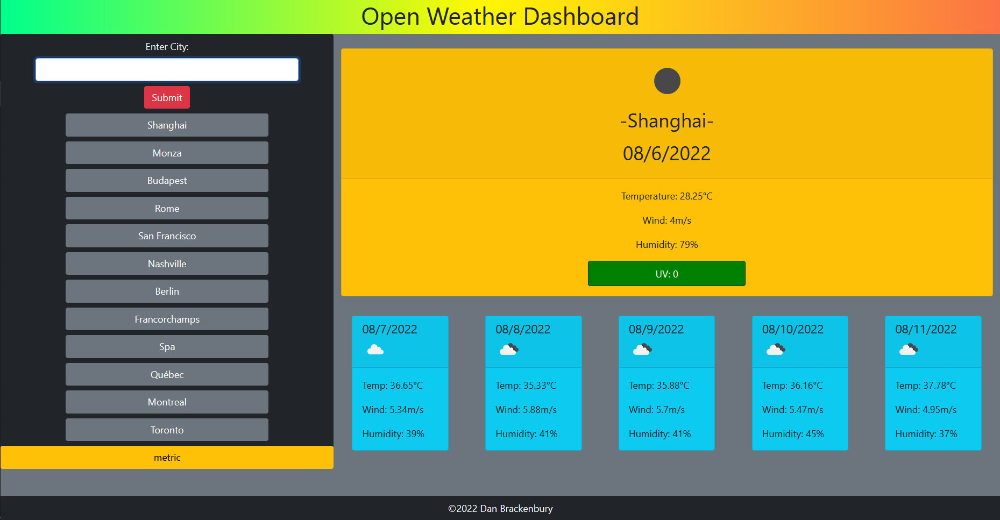

# Open Weather Dashboard
## Dan Brackenbury
### Assembled with HTML / CSS / JavaScript, using Bootstrap, JQuery, and Moment.JS libraries.

A dashboard to check the weather across the world; enter a city and see the current weather, as well as a 5-day forecast.
Stores up to 12 cities in a local search history.

Uses the Open Weather Map API to get forecasts the world over!

Live deployment available at: https://helpvisa.github.io/open-weather-dashboard/

